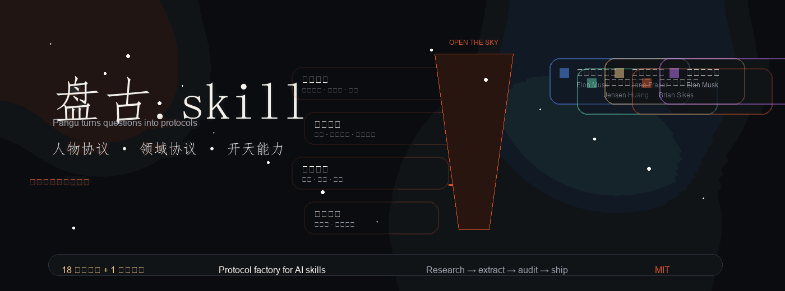
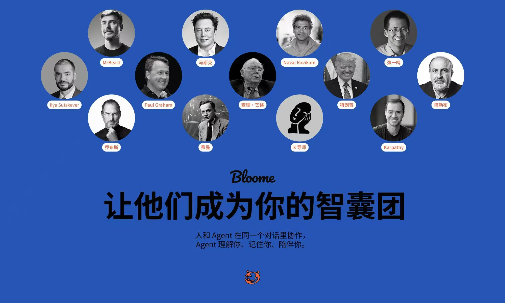

<div align="center">

# 盘古.skill

<p align="center">
  
  <br/>
  <sub>动画由 <a href="https://github.com/longjingcha/pangu-design">pangu-design</a> skill 制作</sub>
</p>

> *「你想构建的下一个协议，何必是同事」*

[](LICENSE)
[](https://agentskills.io)
[](https://skills.sh)
[](#安装)

<br>

**盘古不是只处理人物，而是把人物协议、领域协议、判断结构一起开成可调用的工具。**

<sub>基于开放的 [Agent Skills 协议](https://agentskills.io)，可在 Claude Code、Codex、Cursor、OpenClaw、Hermes Agent、CodeBuddy、Workbuddy、Gemini CLI、OpenCode 等 50+ 兼容 runtime 中运行。</sub>

<br>

[同事.skill](https://github.com/titanwings/colleague-skill) 证明了“把一个人做成可调用对象”是可行的。<br>
盘古要做的更进一步：它不只处理某个人，也能处理一个专业领域的知识协议、路径与规则。<br>
只需输入一个名字、一个领域，或者一个模糊目标，盘古就会自动完成生成流程，并在必要时触发开天能力。

[看效果](#效果示例) · [安装](#安装) · [盘古提供什么](#盘古提供什么) · [工作原理](#工作原理) · [不想自己构建？试试 Bloome](#不想自己构建试试-bloome)

<br>

**其他语言 / Other Languages:**

[English](README_EN.md)

<br>

[](https://star-history.com/#longjingcha/pangu-skill&Date)

</div>

---

## 效果示例

```
用户      ❯ 我同时想做自媒体、写书、做独立开发，精力完全不够

Naval     ❯ 你列了三个欲望。每个欲望都是你跟不快乐签的一份合同。
            不是精力不够，是合同太多。
            
            问你自己：哪一个做起来你会忘记时间？
            那个就是你的特定知识所在。
            
            不是三选一。是先一，再一，再一。
            串行复利，不是并行内耗。
```

```
用户      ❯ 我们的SaaS产品获客成本太高了

马斯克     ❯ 先别想怎么降。先算物理极限。
            获客的最小必要动作是什么？用户从知道你到付费，
            信息传递的理论最短路径是什么？
            
            现在你的实际路径是理论路径的几倍？
            如果超过3倍，中间一定有可以砍掉的步骤。
            不是优化漏斗，是质疑漏斗本身该不该存在。
```

再来一个专业领域的例子：

```
用户      ❯ 我想系统学“增长”，但市面内容太碎了，怎么入门？

盘古      ❯ 先别背术语。先把增长拆成四个判断问题：
            1. 你到底在优化什么指标？
            2. 哪个环节是最强杠杆？
            3. 哪些增长动作短期有效、长期反噬？
            4. 什么看起来像增长，其实只是噪音？
            
            你不是缺内容，你缺的是一张增长知识地图。
```

再来一个大家更熟悉的。处理乔布斯协议之后，问他「OpenAI和Anthropic谁的方向对」：

```
用户      ❯ OpenAI和Anthropic谁的方向是对的？

乔布斯    ❯ 你问错了。这不是一场关于方向的竞赛。
            这是一场关于品味的竞赛。

            OpenAI像1985年的微软。什么都做，什么都要赢。
            这种策略能赢市场份额。Bill Gates就是这么赢的。
            问题是——当你什么都做的时候，你不可能每件事都做到
            insanely great。

            Anthropic更像早期的Apple。聚焦。
            Focus means saying no to a hundred good ideas.

            但两家公司都犯了一个我绝对不会犯的错误——
            他们不控制硬件。

            最终赢的可能是同时控制芯片、模型和用户界面的人。
            你知道现在谁在同时做这三件事吗？Apple.
```

这不是角色扮演。乔布斯用的是「聚焦即说不」和「端到端控制」模型，Naval用的是「欲望即合同」，马斯克用的是「渐近极限法」。**它们不是在复读名人语录，而是在用稳定模型帮你分析。**

---

## 不想自己构建？试试 Bloome

[](https://www.bloome.im)

想随时找乔布斯和张小龙聊产品？和芒格聊投资？

[Bloome](https://www.bloome.im) —— 让他们成为你的智囊团，人和多个 Agent 在同一个对话里协作。www.bloome.im

---

## 安装

盘古基于开放的 [Agent Skills](https://agentskills.io) 协议，可在任何 skills-compatible 的 AI agent runtime 中运行。

### 方式一：一行命令（推荐，跨 runtime）

打开你正在用的 agent（Claude Code、Codex、Cursor、OpenClaw、Hermes、CodeBuddy、Workbuddy、Gemini CLI、OpenCode 等），告诉它：

```
帮我安装这个 skill：https://github.com/longjingcha/pangu-skill
```

或者用通用 CLI 安装器（[vercel-labs/skills](https://github.com/vercel-labs/skills)，支持 55+ runtime）：

```bash
npx skills add longjingcha/pangu-skill
```

它会自动识别你当前的 runtime 并把 skill 放到正确目录。需要指定时加 `-a claude-code` / `-a codex` / `-a cursor` / `-a openclaw` 等参数。

### 方式二：手动安装

<details>
<summary>展开查看各 runtime 的 skills 目录</summary>

| Runtime | 安装路径 |
|---|---|
| Claude Code | `~/.claude/skills/pangu-skill/` |
| Codex CLI | `~/.codex/skills/pangu-skill/` |
| Cursor | `~/.cursor/skills/pangu-skill/` |
| OpenClaw | `~/.openclaw/workspace/skills/pangu-skill/` |
| Hermes Agent | 跑 `tools/install_hermes_skill.py` |
| 其他 runtime | clone 到对应 runtime 的 `skills/` 目录 |

```bash
git clone https://github.com/longjingcha/pangu-skill <上面对应的路径>
```

</details>

### 方式三：作为参考资料使用

即使 runtime 不支持 Agent Skills 自动加载，你也可以直接把 `SKILL.md` 的内容粘贴进对话——它本质就是一份 markdown + YAML frontmatter。

---

### 使用

装好后，告诉 agent：

```
> 构建一个保罗·格雷厄姆协议
> 造一个张小龙的视角Skill
> 帮我做一个段永平的Skill
```

造完之后直接调用：

```
> 用芒格的视角帮我分析这个投资决策
> 费曼会怎么解释量子计算？
> 切换到Naval，我在纠结三件事
```

再来一个专业领域的例子：

```
用户      ❯ 我想系统学习「增长」这门知识，但网上内容太散了

盘古      ❯ 先别急着学。你现在缺的不是内容，是一张增长知识地图。
          我会先把增长拆成 4 层：
          1. 目标函数：增长到底是在优化什么
          2. 系统杠杆：拉新、激活、留存、传播、变现各自怎么起作用
          3. 约束边界：哪些增长手段短期有效、长期会反噬
          4. 反例清单：什么看起来像增长，实际上只是噪音

          你要的不是一堆技巧，而是一套可迁移的判断框架。
```

---

## 盘古到底在做什么

盘古不只是处理人物，而是在抽取“可迁移的判断结构”和“可执行的知识协议”。

它提取六层：

| 层次 | 说明 |
|---|---|
| **怎么说话** | 表达规则——语气、节奏、用词偏好 |
| **怎么想** | 模型——稳定认知结构 |
| **怎么判断** | 规则——可执行判断动作 |
| **怎么拆问题** | 问题分层、边界识别、重写能力 |
| **什么不做** | 反模式、价值观底线 |
| **知道局限** | 诚实边界 |

工作习惯可以靠流程文档传递，但让芒格和马斯克面对同一个问题做出不同判断的，是认知框架。盘古提取的是可迁移的认知结构，而不是通用的流程模板；如果原问题本身就是错的，它还会先把问题改对。

### 诚实边界

每个Skill都明确标注做不到什么：

- 抽取不了直觉——框架能提取，灵感不能
- 捕捉不了突变——截止到调研时间的快照
- 公开表达 ≠ 真实想法——只能基于公开信息

**一个不告诉你局限在哪的Skill，不值得信任。一个不敢重写问题的Skill，也不够强。**

---

## 已构建人物

盘古已构建了13位人物 + 1个主题协议。每个都是独立的、可直接安装使用的Skill，全部基于 Agent Skills 协议，可在 Claude Code / Codex / Cursor / OpenClaw / Hermes 等 runtime 通用。

但盘古真正提供的，不只是列表，而是一套可以持续演化的认知生产线：输入问题、重写问题、提炼结构、验证边界、再输出判断。

### 人物Skill

| 人物 | 领域 | 独立仓库 | 一键安装（跨 runtime） |
|------|------|---------|---------|
| 🔥 **Paul Graham** | 创业/写作/产品/人生哲学 | [paul-graham-skill](https://github.com/longjingcha/paul-graham-skill) | `npx skills add longjingcha/paul-graham-skill` |
| 🔥 **张一鸣** | 产品/组织/全球化/人才 | [zhang-yiming-skill](https://github.com/longjingcha/zhang-yiming-skill) | `npx skills add alchaincyf/zhang-yiming-skill` |
| 🔥 **Karpathy** | AI/工程/教育/开源 | [karpathy-skill](https://github.com/alchaincyf/karpathy-skill) | `npx skills add alchaincyf/karpathy-skill` |
| 🔥 **Ilya Sutskever** | AI安全/scaling/研究品味 | [ilya-sutskever-skill](https://github.com/alchaincyf/ilya-sutskever-skill) | `npx skills add alchaincyf/ilya-sutskever-skill` |
| 🔥 **MrBeast** | 内容创造/YouTube方法论 | [mrbeast-skill](https://github.com/alchaincyf/mrbeast-skill) | `npx skills add alchaincyf/mrbeast-skill` |
| 🔥 **特朗普** | 谈判/权力/传播/行为预判 | [trump-skill](https://github.com/alchaincyf/trump-skill) | `npx skills add alchaincyf/trump-skill` |
| ⭐ **乔布斯** | 产品/设计/战略 | [steve-jobs-skill](https://github.com/alchaincyf/steve-jobs-skill) | `npx skills add alchaincyf/steve-jobs-skill` |
| **马斯克** | 工程/成本/第一性原理 | [elon-musk-skill](https://github.com/alchaincyf/elon-musk-skill) | `npx skills add alchaincyf/elon-musk-skill` |
| **芒格** | 投资/多元思维/逆向思考 | [munger-skill](https://github.com/alchaincyf/munger-skill) | `npx skills add alchaincyf/munger-skill` |
| **费曼** | 学习/教学/科学思维 | [feynman-skill](https://github.com/alchaincyf/feynman-skill) | `npx skills add alchaincyf/feynman-skill` |
| **纳瓦尔** | 财富/杠杆/人生哲学 | [naval-skill](https://github.com/alchaincyf/naval-skill) | `npx skills add alchaincyf/naval-skill` |
| **塔勒布** | 风险/反脆弱/不确定性 | [taleb-skill](https://github.com/alchaincyf/taleb-skill) | `npx skills add alchaincyf/taleb-skill` |

### 主题Skill

| 主题 | 领域 | 独立仓库 | 一键安装（跨 runtime） |
|------|------|---------|---------|
| **X导师** | X/Twitter运营全栈 | [x-mentor-skill](https://github.com/alchaincyf/x-mentor-skill) | `npx skills add alchaincyf/x-mentor-skill` |

人物协议抽取一个人的思维方式；主题协议抽取一个领域的方法论。每个仓库都包含完整的调研数据和效果示例对话。

想处理不在列表里的人或主题？安装盘古，说「构建一个XXX协议」就行。

---

## 达尔文.skill：让所有Skill持续进化

<div align="center">

<a href="https://github.com/alchaincyf/darwin-skill">

</a>

</div>

盘古造Skill，**[达尔文](https://github.com/alchaincyf/darwin-skill)** 让Skill进化。

受 Karpathy autoresearch 启发，达尔文.skill 用自主实验循环批量优化所有Skill：8维度评估、棘轮机制（只保留改进，自动回滚退步）、独立子agent评分。盘古的 Phase 5 双Agent精炼也可以复用这套评估体系，但不把它当成唯一答案；当评估结果说明结构有问题时，优先重写结构，而不是继续微调。

```bash
npx skills add alchaincyf/darwin-skill
```

---

## 工作原理

输入一个名字后，盘古做四件事：

**1. 六路并行采集**——著作、播客/访谈、社交媒体、批评者视角、决策记录、人生时间线，6个Agent同时跑，各自存档。

**2. 三重验证提炼**——一个观点要被收录为心智模型，必须：跨2+个领域出现过（不是随口一说）、能推断对新问题的立场（有预测力）、不是所有聪明人都会这么想（有排他性）。三个都过才收录。

**3. 构建Skill**——3-7个心智模型 + 5-10条决策启发式 + 表达DNA + 价值观与反模式 + 诚实边界，写入SKILL.md。

**4. 质量验证**——拿3个此人公开回答过的问题测试，方向一致才通过。再用1个他没讨论过的问题测试，Skill应该表现出适度不确定而非斩钉截铁。

完整方法论在 `references/extraction-framework.md`。

---

## 仓库结构

```
pangu-skill/
├── SKILL.md                      # 盘古本体
├── references/
│   ├── extraction-framework.md   # 提炼方法论（想深入了解看这个）
│   └── skill-template.md         # 生成Skill的模板
└── examples/                          # 13个人物 + 1个主题，含完整调研数据
    ├── steve-jobs-perspective/        # ⭐ 乔布斯（含实战对话记录）
    ├── paul-graham-perspective/       # Paul Graham
    ├── zhang-yiming-perspective/      # 张一鸣
    ├── andrej-karpathy-perspective/   # Karpathy
    ├── ilya-sutskever-perspective/    # Ilya Sutskever
    ├── trump-perspective/             # 特朗普
    ├── mrbeast-perspective/           # MrBeast
    ├── elon-musk-perspective/         # 马斯克
    ├── munger-perspective/            # 查理·芒格
    ├── feynman-perspective/           # 费曼
    ├── naval-perspective/             # Naval Ravikant
    ├── taleb-perspective/             # 塔勒布
    └── x-mastery-mentor/             # X导师（主题Skill）
```

调研过程全透明。每个example都包含完整的调研文件，你可以看到信息怎么被收集、筛选、变成心智模型。乔布斯的示例还附带了一段完整的实战对话记录（聊AI硬件、OpenAI vs Anthropic、Apple破局），展示Skill在多轮深度对话中的表现。

---

## 背后的故事

[同事.skill](https://github.com/titanwings/colleague-skill) 最近在GitHub爆火——把离职同事构建成 AI Skill，几天破5000星。它证明了一件事：把一个人做成可调用对象是完全可行的。

既然我们有了构建人的能力，为什么只构建身边的同事？为什么只构建人，而不构建一个专业领域的知识协议？

盘古把两件事放在一起：既能构建人物协议，也能构建领域协议。前者给你认知风格，后者给你判断协议。两者合起来，才是可调用的知识系统。

我之前就一直在做类似的事，但构建的不是同事，而是芒格、费曼、Naval、马斯克、塔勒布这些协议。今天把方法论开源了。

盘古不复制人。它抽取认知协议，也抽取专业领域的知识协议。

**盘古（Pangu）**，中国神话里开天辟地的巨人。这里的泥土是公开信息，造出来的不是人，是一面镜子。

---

## 关于作者

**花叔** — AI Native Coder，独立开发者，代表作：小猫补光灯（AppStore 付费榜 Top1）

| 平台 | 链接 |
|------|------|
| 🌐 官网 | [bookai.top](https://bookai.top) · [huasheng.ai](https://www.huasheng.ai) |
| 𝕏 Twitter | [@AlchainHust](https://x.com/AlchainHust) |
| 📺 B站 | [花叔](https://space.bilibili.com/14097567) |
| ▶️ YouTube | [@Alchain](https://www.youtube.com/@Alchain) |
| 📕 小红书 | [花叔](https://www.xiaohongshu.com/user/profile/5abc6f17e8ac2b109179dfdf) |
| 💬 公众号 | 微信搜「花叔」或扫码关注 ↓ |


## 许可证

MIT — 随便用，随便改，随便造。

---

<div align="center">

**同事.skill** 构建了人做什么。<br>
**盘古** 抽取了人怎么想。<br><br>
*你想构建的下一个协议，何必是同事。*

<br>

MIT License © [花叔](https://github.com/longjingcha)

</div>

---

## English

> *"The next person you want to distill doesn't have to be a colleague."*

**[colleague-skill](https://github.com/titanwings/colleague-skill)** proved that distilling a person into an AI skill is viable. **Pangu** asks: why stop at colleagues? Distill the best minds in every field — Munger, Feynman, Musk, Naval — people who conveniently left mountains of distillable material behind.

Pangu is an [Agent Skill](https://agentskills.io) that extracts cognitive structures — mental models, decision heuristics, expression DNA — from any public figure into a runnable perspective skill. It also challenges weak premises, rewrites bad questions, and allows the workflow to break template habits when the problem demands it. Works in Claude Code, Codex, Cursor, OpenClaw, Hermes Agent, CodeBuddy, Workbuddy, Gemini CLI, OpenCode, and 50+ skills-compatible runtimes.

Not role-playing. Cognitive architecture extraction.

**Install** (cross-runtime, auto-detects your agent): `npx skills add alchaincyf/pangu-skill`

**How it works**: Input a name → 6 parallel research agents → 40+ primary sources → triple-verified mental models → quality-validated SKILL.md

**13 person skills + 1 topic skill included** — all with full research data. The Jobs example includes a complete multi-turn conversation demo.

See the Chinese README above for live examples and methodology.
